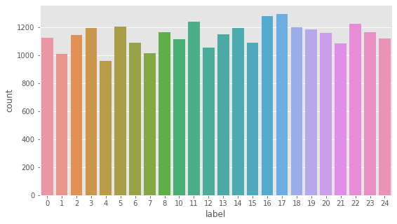
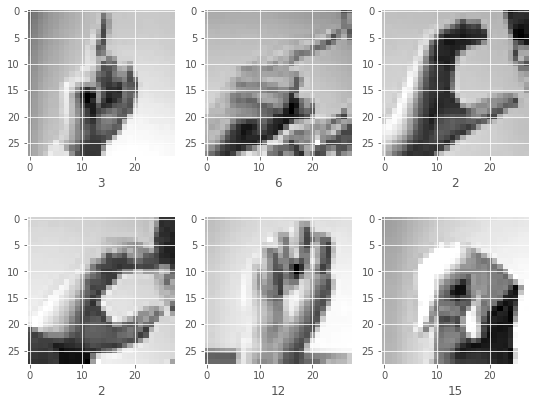
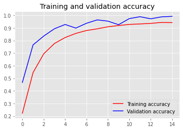
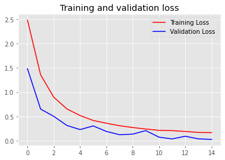

# Sign Language MNIST


```python
import numpy as np
import pandas as pd
```


```python
# Loading the training dataset. In this dataset instead of images, we have excel file which contains the pixel values of images.
```


```python
df_train = pd.read_csv(r"\sign_mnist_train.csv")

df_train.head()
```


<div>
<style scoped>
    .dataframe tbody tr th:only-of-type {
        vertical-align: middle;
    }

    .dataframe tbody tr th {
        vertical-align: top;
    }

    .dataframe thead th {
        text-align: right;
    }
</style>
<table border="1" class="dataframe">
  <thead>
    <tr style="text-align: right;">
      <th></th>
      <th>label</th>
      <th>pixel1</th>
      <th>pixel2</th>
      <th>pixel3</th>
      <th>pixel4</th>
      <th>pixel5</th>
      <th>pixel6</th>
      <th>pixel7</th>
      <th>pixel8</th>
      <th>pixel9</th>
      <th>...</th>
      <th>pixel775</th>
      <th>pixel776</th>
      <th>pixel777</th>
      <th>pixel778</th>
      <th>pixel779</th>
      <th>pixel780</th>
      <th>pixel781</th>
      <th>pixel782</th>
      <th>pixel783</th>
      <th>pixel784</th>
    </tr>
  </thead>
  <tbody>
    <tr>
      <th>0</th>
      <td>3</td>
      <td>107</td>
      <td>118</td>
      <td>127</td>
      <td>134</td>
      <td>139</td>
      <td>143</td>
      <td>146</td>
      <td>150</td>
      <td>153</td>
      <td>...</td>
      <td>207</td>
      <td>207</td>
      <td>207</td>
      <td>207</td>
      <td>206</td>
      <td>206</td>
      <td>206</td>
      <td>204</td>
      <td>203</td>
      <td>202</td>
    </tr>
    <tr>
      <th>1</th>
      <td>6</td>
      <td>155</td>
      <td>157</td>
      <td>156</td>
      <td>156</td>
      <td>156</td>
      <td>157</td>
      <td>156</td>
      <td>158</td>
      <td>158</td>
      <td>...</td>
      <td>69</td>
      <td>149</td>
      <td>128</td>
      <td>87</td>
      <td>94</td>
      <td>163</td>
      <td>175</td>
      <td>103</td>
      <td>135</td>
      <td>149</td>
    </tr>
    <tr>
      <th>2</th>
      <td>2</td>
      <td>187</td>
      <td>188</td>
      <td>188</td>
      <td>187</td>
      <td>187</td>
      <td>186</td>
      <td>187</td>
      <td>188</td>
      <td>187</td>
      <td>...</td>
      <td>202</td>
      <td>201</td>
      <td>200</td>
      <td>199</td>
      <td>198</td>
      <td>199</td>
      <td>198</td>
      <td>195</td>
      <td>194</td>
      <td>195</td>
    </tr>
    <tr>
      <th>3</th>
      <td>2</td>
      <td>211</td>
      <td>211</td>
      <td>212</td>
      <td>212</td>
      <td>211</td>
      <td>210</td>
      <td>211</td>
      <td>210</td>
      <td>210</td>
      <td>...</td>
      <td>235</td>
      <td>234</td>
      <td>233</td>
      <td>231</td>
      <td>230</td>
      <td>226</td>
      <td>225</td>
      <td>222</td>
      <td>229</td>
      <td>163</td>
    </tr>
    <tr>
      <th>4</th>
      <td>13</td>
      <td>164</td>
      <td>167</td>
      <td>170</td>
      <td>172</td>
      <td>176</td>
      <td>179</td>
      <td>180</td>
      <td>184</td>
      <td>185</td>
      <td>...</td>
      <td>92</td>
      <td>105</td>
      <td>105</td>
      <td>108</td>
      <td>133</td>
      <td>163</td>
      <td>157</td>
      <td>163</td>
      <td>164</td>
      <td>179</td>
    </tr>
  </tbody>
</table>
<p>5 rows × 785 columns</p>
</div>


```python
# Same goes for testing data.
```


```python
df_test = pd.read_csv(r"\sign_mnist_test.csv")

df_test.head()
```


<div>
<style scoped>
    .dataframe tbody tr th:only-of-type {
        vertical-align: middle;
    }

    .dataframe tbody tr th {
        vertical-align: top;
    }

    .dataframe thead th {
        text-align: right;
    }
</style>
<table border="1" class="dataframe">
  <thead>
    <tr style="text-align: right;">
      <th></th>
      <th>label</th>
      <th>pixel1</th>
      <th>pixel2</th>
      <th>pixel3</th>
      <th>pixel4</th>
      <th>pixel5</th>
      <th>pixel6</th>
      <th>pixel7</th>
      <th>pixel8</th>
      <th>pixel9</th>
      <th>...</th>
      <th>pixel775</th>
      <th>pixel776</th>
      <th>pixel777</th>
      <th>pixel778</th>
      <th>pixel779</th>
      <th>pixel780</th>
      <th>pixel781</th>
      <th>pixel782</th>
      <th>pixel783</th>
      <th>pixel784</th>
    </tr>
  </thead>
  <tbody>
    <tr>
      <th>0</th>
      <td>6</td>
      <td>149</td>
      <td>149</td>
      <td>150</td>
      <td>150</td>
      <td>150</td>
      <td>151</td>
      <td>151</td>
      <td>150</td>
      <td>151</td>
      <td>...</td>
      <td>138</td>
      <td>148</td>
      <td>127</td>
      <td>89</td>
      <td>82</td>
      <td>96</td>
      <td>106</td>
      <td>112</td>
      <td>120</td>
      <td>107</td>
    </tr>
    <tr>
      <th>1</th>
      <td>5</td>
      <td>126</td>
      <td>128</td>
      <td>131</td>
      <td>132</td>
      <td>133</td>
      <td>134</td>
      <td>135</td>
      <td>135</td>
      <td>136</td>
      <td>...</td>
      <td>47</td>
      <td>104</td>
      <td>194</td>
      <td>183</td>
      <td>186</td>
      <td>184</td>
      <td>184</td>
      <td>184</td>
      <td>182</td>
      <td>180</td>
    </tr>
    <tr>
      <th>2</th>
      <td>10</td>
      <td>85</td>
      <td>88</td>
      <td>92</td>
      <td>96</td>
      <td>105</td>
      <td>123</td>
      <td>135</td>
      <td>143</td>
      <td>147</td>
      <td>...</td>
      <td>68</td>
      <td>166</td>
      <td>242</td>
      <td>227</td>
      <td>230</td>
      <td>227</td>
      <td>226</td>
      <td>225</td>
      <td>224</td>
      <td>222</td>
    </tr>
    <tr>
      <th>3</th>
      <td>0</td>
      <td>203</td>
      <td>205</td>
      <td>207</td>
      <td>206</td>
      <td>207</td>
      <td>209</td>
      <td>210</td>
      <td>209</td>
      <td>210</td>
      <td>...</td>
      <td>154</td>
      <td>248</td>
      <td>247</td>
      <td>248</td>
      <td>253</td>
      <td>236</td>
      <td>230</td>
      <td>240</td>
      <td>253</td>
      <td>255</td>
    </tr>
    <tr>
      <th>4</th>
      <td>3</td>
      <td>188</td>
      <td>191</td>
      <td>193</td>
      <td>195</td>
      <td>199</td>
      <td>201</td>
      <td>202</td>
      <td>203</td>
      <td>203</td>
      <td>...</td>
      <td>26</td>
      <td>40</td>
      <td>64</td>
      <td>48</td>
      <td>29</td>
      <td>46</td>
      <td>49</td>
      <td>46</td>
      <td>46</td>
      <td>53</td>
    </tr>
  </tbody>
</table>
<p>5 rows × 785 columns</p>
</div>


```python
df_train.describe()    #by this we can see the max and min values of each columns
```


<div>
<style scoped>
    .dataframe tbody tr th:only-of-type {
        vertical-align: middle;
    }

    .dataframe tbody tr th {
        vertical-align: top;
    }

    .dataframe thead th {
        text-align: right;
    }
</style>
<table border="1" class="dataframe">
  <thead>
    <tr style="text-align: right;">
      <th></th>
      <th>label</th>
      <th>pixel1</th>
      <th>pixel2</th>
      <th>pixel3</th>
      <th>pixel4</th>
      <th>pixel5</th>
      <th>pixel6</th>
      <th>pixel7</th>
      <th>pixel8</th>
      <th>pixel9</th>
      <th>...</th>
      <th>pixel775</th>
      <th>pixel776</th>
      <th>pixel777</th>
      <th>pixel778</th>
      <th>pixel779</th>
      <th>pixel780</th>
      <th>pixel781</th>
      <th>pixel782</th>
      <th>pixel783</th>
      <th>pixel784</th>
    </tr>
  </thead>
  <tbody>
    <tr>
      <th>count</th>
      <td>27455.000000</td>
      <td>27455.000000</td>
      <td>27455.000000</td>
      <td>27455.000000</td>
      <td>27455.000000</td>
      <td>27455.000000</td>
      <td>27455.000000</td>
      <td>27455.000000</td>
      <td>27455.000000</td>
      <td>27455.000000</td>
      <td>...</td>
      <td>27455.000000</td>
      <td>27455.000000</td>
      <td>27455.000000</td>
      <td>27455.000000</td>
      <td>27455.000000</td>
      <td>27455.000000</td>
      <td>27455.000000</td>
      <td>27455.000000</td>
      <td>27455.000000</td>
      <td>27455.000000</td>
    </tr>
    <tr>
      <th>mean</th>
      <td>12.318813</td>
      <td>145.419377</td>
      <td>148.500273</td>
      <td>151.247714</td>
      <td>153.546531</td>
      <td>156.210891</td>
      <td>158.411255</td>
      <td>160.472154</td>
      <td>162.339683</td>
      <td>163.954799</td>
      <td>...</td>
      <td>141.104863</td>
      <td>147.495611</td>
      <td>153.325806</td>
      <td>159.125332</td>
      <td>161.969259</td>
      <td>162.736696</td>
      <td>162.906137</td>
      <td>161.966454</td>
      <td>161.137898</td>
      <td>159.824731</td>
    </tr>
    <tr>
      <th>std</th>
      <td>7.287552</td>
      <td>41.358555</td>
      <td>39.942152</td>
      <td>39.056286</td>
      <td>38.595247</td>
      <td>37.111165</td>
      <td>36.125579</td>
      <td>35.016392</td>
      <td>33.661998</td>
      <td>32.651607</td>
      <td>...</td>
      <td>63.751194</td>
      <td>65.512894</td>
      <td>64.427412</td>
      <td>63.708507</td>
      <td>63.738316</td>
      <td>63.444008</td>
      <td>63.509210</td>
      <td>63.298721</td>
      <td>63.610415</td>
      <td>64.396846</td>
    </tr>
    <tr>
      <th>min</th>
      <td>0.000000</td>
      <td>0.000000</td>
      <td>0.000000</td>
      <td>0.000000</td>
      <td>0.000000</td>
      <td>0.000000</td>
      <td>0.000000</td>
      <td>0.000000</td>
      <td>0.000000</td>
      <td>0.000000</td>
      <td>...</td>
      <td>0.000000</td>
      <td>0.000000</td>
      <td>0.000000</td>
      <td>0.000000</td>
      <td>0.000000</td>
      <td>0.000000</td>
      <td>0.000000</td>
      <td>0.000000</td>
      <td>0.000000</td>
      <td>0.000000</td>
    </tr>
    <tr>
      <th>25%</th>
      <td>6.000000</td>
      <td>121.000000</td>
      <td>126.000000</td>
      <td>130.000000</td>
      <td>133.000000</td>
      <td>137.000000</td>
      <td>140.000000</td>
      <td>142.000000</td>
      <td>144.000000</td>
      <td>146.000000</td>
      <td>...</td>
      <td>92.000000</td>
      <td>96.000000</td>
      <td>103.000000</td>
      <td>112.000000</td>
      <td>120.000000</td>
      <td>125.000000</td>
      <td>128.000000</td>
      <td>128.000000</td>
      <td>128.000000</td>
      <td>125.500000</td>
    </tr>
    <tr>
      <th>50%</th>
      <td>13.000000</td>
      <td>150.000000</td>
      <td>153.000000</td>
      <td>156.000000</td>
      <td>158.000000</td>
      <td>160.000000</td>
      <td>162.000000</td>
      <td>164.000000</td>
      <td>165.000000</td>
      <td>166.000000</td>
      <td>...</td>
      <td>144.000000</td>
      <td>162.000000</td>
      <td>172.000000</td>
      <td>180.000000</td>
      <td>183.000000</td>
      <td>184.000000</td>
      <td>184.000000</td>
      <td>182.000000</td>
      <td>182.000000</td>
      <td>182.000000</td>
    </tr>
    <tr>
      <th>75%</th>
      <td>19.000000</td>
      <td>174.000000</td>
      <td>176.000000</td>
      <td>178.000000</td>
      <td>179.000000</td>
      <td>181.000000</td>
      <td>182.000000</td>
      <td>183.000000</td>
      <td>184.000000</td>
      <td>185.000000</td>
      <td>...</td>
      <td>196.000000</td>
      <td>202.000000</td>
      <td>205.000000</td>
      <td>207.000000</td>
      <td>208.000000</td>
      <td>207.000000</td>
      <td>207.000000</td>
      <td>206.000000</td>
      <td>204.000000</td>
      <td>204.000000</td>
    </tr>
    <tr>
      <th>max</th>
      <td>24.000000</td>
      <td>255.000000</td>
      <td>255.000000</td>
      <td>255.000000</td>
      <td>255.000000</td>
      <td>255.000000</td>
      <td>255.000000</td>
      <td>255.000000</td>
      <td>255.000000</td>
      <td>255.000000</td>
      <td>...</td>
      <td>255.000000</td>
      <td>255.000000</td>
      <td>255.000000</td>
      <td>255.000000</td>
      <td>255.000000</td>
      <td>255.000000</td>
      <td>255.000000</td>
      <td>255.000000</td>
      <td>255.000000</td>
      <td>255.000000</td>
    </tr>
  </tbody>
</table>
<p>8 rows × 785 columns</p>
</div>


```python
df_train.info()     #here we can also see the no of data we have, i.e 2755 images to train our model, 
                    #785 columns with value for each pixel
```

    <class 'pandas.core.frame.DataFrame'>
    RangeIndex: 27455 entries, 0 to 27454
    Columns: 785 entries, label to pixel784
    dtypes: int64(785)
    memory usage: 164.4 MB
    


```python
df_test.info()      #also same functtion for the testing data
```

    <class 'pandas.core.frame.DataFrame'>
    RangeIndex: 7172 entries, 0 to 7171
    Columns: 785 entries, label to pixel784
    dtypes: int64(785)
    memory usage: 43.0 MB
    


```python
train_label = df_train["label"]
test_label = df_test["label"]
```


```python
import seaborn as sns
import matplotlib.pyplot as plt

plt.style.use("ggplot")
plt.figure(figsize =(9,5))
sns.countplot(x= df_train['label'],data = df_train)
plt.show()
```


    

    


```python
df_train.drop("label",axis=1,inplace=True)
df_train.head(2)
```


<div>
<style scoped>
    .dataframe tbody tr th:only-of-type {
        vertical-align: middle;
    }

    .dataframe tbody tr th {
        vertical-align: top;
    }

    .dataframe thead th {
        text-align: right;
    }
</style>
<table border="1" class="dataframe">
  <thead>
    <tr style="text-align: right;">
      <th></th>
      <th>pixel1</th>
      <th>pixel2</th>
      <th>pixel3</th>
      <th>pixel4</th>
      <th>pixel5</th>
      <th>pixel6</th>
      <th>pixel7</th>
      <th>pixel8</th>
      <th>pixel9</th>
      <th>pixel10</th>
      <th>...</th>
      <th>pixel775</th>
      <th>pixel776</th>
      <th>pixel777</th>
      <th>pixel778</th>
      <th>pixel779</th>
      <th>pixel780</th>
      <th>pixel781</th>
      <th>pixel782</th>
      <th>pixel783</th>
      <th>pixel784</th>
    </tr>
  </thead>
  <tbody>
    <tr>
      <th>0</th>
      <td>107</td>
      <td>118</td>
      <td>127</td>
      <td>134</td>
      <td>139</td>
      <td>143</td>
      <td>146</td>
      <td>150</td>
      <td>153</td>
      <td>156</td>
      <td>...</td>
      <td>207</td>
      <td>207</td>
      <td>207</td>
      <td>207</td>
      <td>206</td>
      <td>206</td>
      <td>206</td>
      <td>204</td>
      <td>203</td>
      <td>202</td>
    </tr>
    <tr>
      <th>1</th>
      <td>155</td>
      <td>157</td>
      <td>156</td>
      <td>156</td>
      <td>156</td>
      <td>157</td>
      <td>156</td>
      <td>158</td>
      <td>158</td>
      <td>157</td>
      <td>...</td>
      <td>69</td>
      <td>149</td>
      <td>128</td>
      <td>87</td>
      <td>94</td>
      <td>163</td>
      <td>175</td>
      <td>103</td>
      <td>135</td>
      <td>149</td>
    </tr>
  </tbody>
</table>
<p>2 rows × 784 columns</p>
</div>


```python
df_test.drop("label",axis=1,inplace=True)
df_test.head(2)
```


<div>
<style scoped>
    .dataframe tbody tr th:only-of-type {
        vertical-align: middle;
    }

    .dataframe tbody tr th {
        vertical-align: top;
    }

    .dataframe thead th {
        text-align: right;
    }
</style>
<table border="1" class="dataframe">
  <thead>
    <tr style="text-align: right;">
      <th></th>
      <th>pixel1</th>
      <th>pixel2</th>
      <th>pixel3</th>
      <th>pixel4</th>
      <th>pixel5</th>
      <th>pixel6</th>
      <th>pixel7</th>
      <th>pixel8</th>
      <th>pixel9</th>
      <th>pixel10</th>
      <th>...</th>
      <th>pixel775</th>
      <th>pixel776</th>
      <th>pixel777</th>
      <th>pixel778</th>
      <th>pixel779</th>
      <th>pixel780</th>
      <th>pixel781</th>
      <th>pixel782</th>
      <th>pixel783</th>
      <th>pixel784</th>
    </tr>
  </thead>
  <tbody>
    <tr>
      <th>0</th>
      <td>149</td>
      <td>149</td>
      <td>150</td>
      <td>150</td>
      <td>150</td>
      <td>151</td>
      <td>151</td>
      <td>150</td>
      <td>151</td>
      <td>152</td>
      <td>...</td>
      <td>138</td>
      <td>148</td>
      <td>127</td>
      <td>89</td>
      <td>82</td>
      <td>96</td>
      <td>106</td>
      <td>112</td>
      <td>120</td>
      <td>107</td>
    </tr>
    <tr>
      <th>1</th>
      <td>126</td>
      <td>128</td>
      <td>131</td>
      <td>132</td>
      <td>133</td>
      <td>134</td>
      <td>135</td>
      <td>135</td>
      <td>136</td>
      <td>138</td>
      <td>...</td>
      <td>47</td>
      <td>104</td>
      <td>194</td>
      <td>183</td>
      <td>186</td>
      <td>184</td>
      <td>184</td>
      <td>184</td>
      <td>182</td>
      <td>180</td>
    </tr>
  </tbody>
</table>
<p>2 rows × 784 columns</p>
</div>


```python
x_train = df_train.values

x_train
```


    array([[107, 118, 127, ..., 204, 203, 202],
           [155, 157, 156, ..., 103, 135, 149],
           [187, 188, 188, ..., 195, 194, 195],
           ...,
           [174, 174, 174, ..., 202, 200, 200],
           [177, 181, 184, ...,  64,  87,  93],
           [179, 180, 180, ..., 205, 209, 215]], dtype=int64)


```python
x_train = x_train.reshape(-1,28,28,1)

x_test = df_test.values.reshape(-1,28,28,1)
```


```python
from keras.models import Sequential
from sklearn.preprocessing import LabelBinarizer
from tensorflow.keras.preprocessing.image import ImageDataGenerator
from tensorflow.keras.layers import Flatten,Dense,Dropout,MaxPool2D,Conv2D
```


```python
lb = LabelBinarizer()
y_train = lb.fit_transform(train_label)
y_test = lb.fit_transform(test_label)
```


```python
plt.figure(figsize=(9,7))
for i in range(6):
    plt.subplot(2,3,i+1)
    plt.imshow(x_train[i],cmap='gray')
    plt.xlabel(np.argmax(y_train[i]))
    
plt.show()     # visualizing the images 
```


    

    


```python
train_datagen = ImageDataGenerator(rescale=(1./255),
                                    rotation_range = 30,
                                    width_shift_range = 0.2,
                                    height_shift_range =0.2,
                                    shear_range=0.2,
                                    zoom_range=0.2,
                                    horizontal_flip=True)

val_datagen = ImageDataGenerator(rescale=(1./255))
```


```python
from tensorflow.keras import Sequential

model = Sequential()

model.add(Conv2D(32,(3,3),padding = 'same',input_shape=(28,28,1),activation = 'relu'))
model.add(MaxPool2D((2,2)))

model.add(Conv2D(64,(3,3),padding = 'same',activation = 'relu'))
model.add(MaxPool2D((2,2)))

model.add(Conv2D(128,(3,3),padding = 'same',activation = 'relu'))
model.add(MaxPool2D((2,2)))

model.add(Flatten())
model.add(Dense(512,activation='relu'))
model.add(Dense(24,activation="softmax"))
```


```python
model.summary()
```

    Model: "sequential"
    _________________________________________________________________
    Layer (type)                 Output Shape              Param #   
    =================================================================
    conv2d (Conv2D)              (None, 28, 28, 32)        320       
    _________________________________________________________________
    max_pooling2d (MaxPooling2D) (None, 14, 14, 32)        0         
    _________________________________________________________________
    conv2d_1 (Conv2D)            (None, 14, 14, 64)        18496     
    _________________________________________________________________
    max_pooling2d_1 (MaxPooling2 (None, 7, 7, 64)          0         
    _________________________________________________________________
    conv2d_2 (Conv2D)            (None, 7, 7, 128)         73856     
    _________________________________________________________________
    max_pooling2d_2 (MaxPooling2 (None, 3, 3, 128)         0         
    _________________________________________________________________
    flatten (Flatten)            (None, 1152)              0         
    _________________________________________________________________
    dense (Dense)                (None, 512)               590336    
    _________________________________________________________________
    dense_1 (Dense)              (None, 24)                12312     
    =================================================================
    Total params: 695,320
    Trainable params: 695,320
    Non-trainable params: 0
    _________________________________________________________________
    


```python
model.compile(optimizer='adam',
              loss='categorical_crossentropy',
              metrics='accuracy')
```


```python
history = model.fit_generator(generator = train_datagen.flow(x_train,y_train,batch_size=32),
                              validation_data = val_datagen.flow(x_test,y_test),epochs=15,verbose=1)
```

    C:\Users\hruti\anaconda3\lib\site-packages\tensorflow\python\keras\engine\training.py:1844: UserWarning: `Model.fit_generator` is deprecated and will be removed in a future version. Please use `Model.fit`, which supports generators.
      warnings.warn('`Model.fit_generator` is deprecated and '
    

    Epoch 1/15
    858/858 [==============================] - 36s 41ms/step - loss: 2.8859 - accuracy: 0.1217 - val_loss: 1.4805 - val_accuracy: 0.4668
    Epoch 2/15
    858/858 [==============================] - 30s 35ms/step - loss: 1.5351 - accuracy: 0.4874 - val_loss: 0.6499 - val_accuracy: 0.7651
    Epoch 3/15
    858/858 [==============================] - 33s 38ms/step - loss: 0.9702 - accuracy: 0.6680 - val_loss: 0.4997 - val_accuracy: 0.8353
    Epoch 4/15
    858/858 [==============================] - 33s 39ms/step - loss: 0.7016 - accuracy: 0.7597 - val_loss: 0.3128 - val_accuracy: 0.8933
    Epoch 5/15
    858/858 [==============================] - 34s 40ms/step - loss: 0.5437 - accuracy: 0.8142 - val_loss: 0.2275 - val_accuracy: 0.9275
    Epoch 6/15
    858/858 [==============================] - 33s 39ms/step - loss: 0.4368 - accuracy: 0.8480 - val_loss: 0.3028 - val_accuracy: 0.8988
    Epoch 7/15
    858/858 [==============================] - 37s 43ms/step - loss: 0.3741 - accuracy: 0.8741 - val_loss: 0.1899 - val_accuracy: 0.9371
    Epoch 8/15
    858/858 [==============================] - 37s 43ms/step - loss: 0.3155 - accuracy: 0.8888 - val_loss: 0.1224 - val_accuracy: 0.9640
    Epoch 9/15
    858/858 [==============================] - 38s 44ms/step - loss: 0.2820 - accuracy: 0.9044 - val_loss: 0.1338 - val_accuracy: 0.9540
    Epoch 10/15
    858/858 [==============================] - 39s 45ms/step - loss: 0.2467 - accuracy: 0.9141 - val_loss: 0.2067 - val_accuracy: 0.9257
    Epoch 11/15
    858/858 [==============================] - 44s 52ms/step - loss: 0.2207 - accuracy: 0.9257 - val_loss: 0.0716 - val_accuracy: 0.9741
    Epoch 12/15
    858/858 [==============================] - 33s 38ms/step - loss: 0.2149 - accuracy: 0.9272 - val_loss: 0.0354 - val_accuracy: 0.9893
    Epoch 13/15
    858/858 [==============================] - 31s 36ms/step - loss: 0.1912 - accuracy: 0.9356 - val_loss: 0.0903 - val_accuracy: 0.9725
    Epoch 14/15
    858/858 [==============================] - 31s 36ms/step - loss: 0.1701 - accuracy: 0.9437 - val_loss: 0.0365 - val_accuracy: 0.9879
    Epoch 15/15
    858/858 [==============================] - 30s 35ms/step - loss: 0.1668 - accuracy: 0.9417 - val_loss: 0.0250 - val_accuracy: 0.9923
    


```python
import warnings
warnings.filterwarnings("ignore")
loss,acc = model.evaluate_generator(val_datagen.flow(x_test,y_test))
print(f"Accuracy: {acc*100}")
print(f"Loss: {loss}")
```

    Accuracy: 99.23312664031982
    Loss: 0.024974476546049118
    


```python
import matplotlib.pyplot as plt
acc = history.history['accuracy']
val_acc = history.history['val_accuracy']
loss = history.history['loss']
val_loss = history.history['val_loss']

epochs = range(len(acc))

plt.plot(epochs, acc, 'r', label='Training accuracy')
plt.plot(epochs, val_acc, 'b', label='Validation accuracy')
plt.title('Training and validation accuracy')
plt.legend(loc=0)
plt.figure()

plt.plot(epochs, loss, 'r', label='Training Loss')
plt.plot(epochs, val_loss, 'b', label='Validation Loss')
plt.title('Training and validation loss')
plt.legend()


plt.show()
```


    

    


    

    


```python

```
